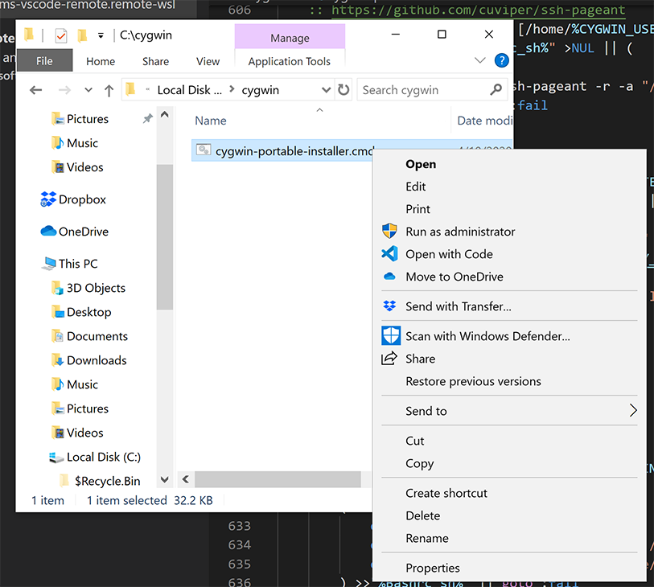
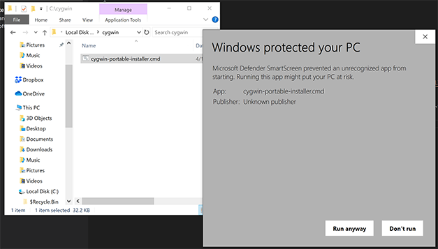
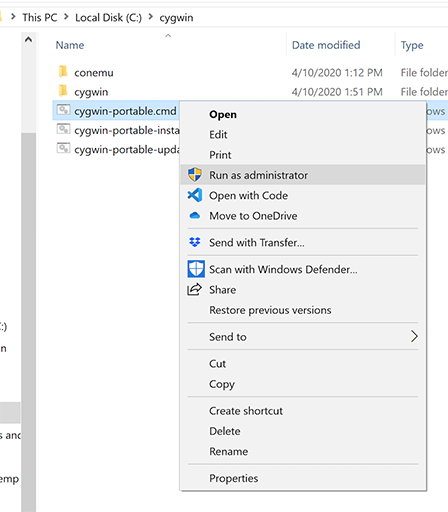
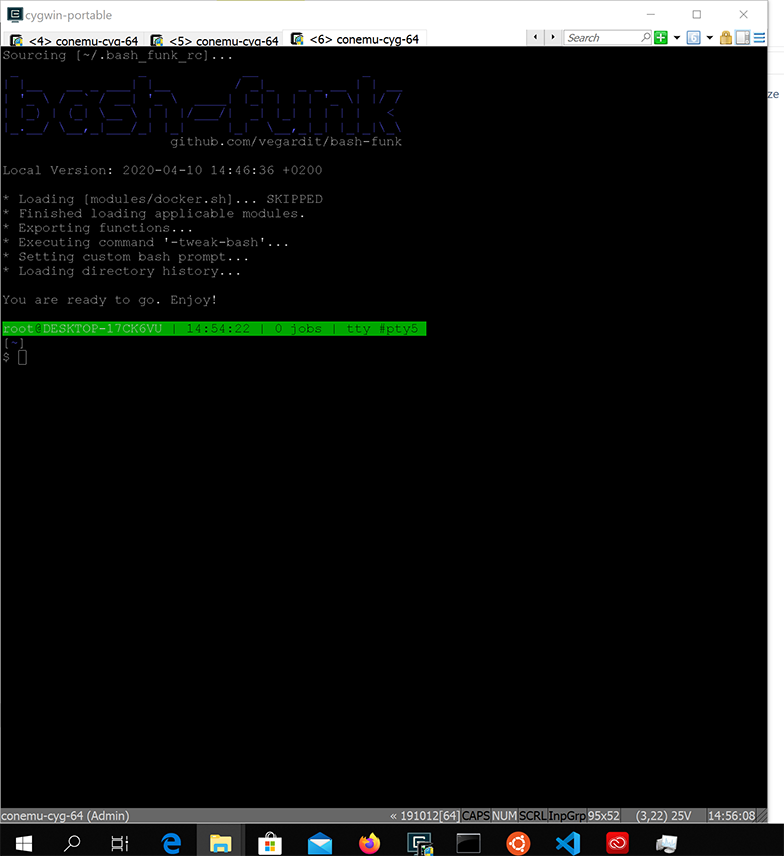
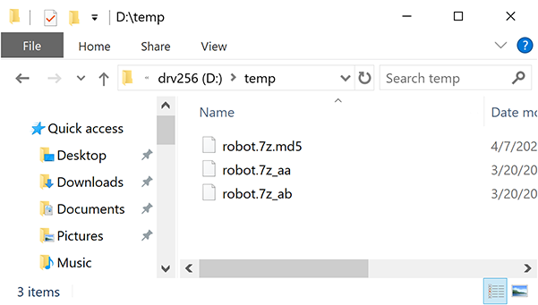

# Restaurar SSD - Windows

Este guia explica como regravar o SSD de Robótica/Elementos usando Windows. Para concluir este guia, você precisa ter 53GB de espaço livre em disco.

Vai ser necessário gravar bytes direto em meio físico, portanto faça com **muito cuidado**. Se você errar poderá perder seu sistema operacional principal ou seus dados.

## 1. Instalar Cygwin

O Windows carece de algumas das ferramentas que os sistemas Unix têm. Por este motivo vamos instalar o Cygwin antes. 

Vamos instalar o [Portable Cygwin](https://vegardit.github.io/cygwin-portable-installer/)

Instale o Portable Cygwin:

Crie um diretório onde instalar, por exemplo

    C:\cygwin

Baixe este arquivo [https://vegardit.github.io/cygwin-portable-installer/cygwin-portable-installer.cmd](https://vegardit.github.io/cygwin-portable-installer/cygwin-portable-installer.cmd) para aquele diretório.

Usando o Windows Explorer, clique com o botão direito no arquivo  `cygwin-portable-installer.cmd` baixado e clique "Run as Administrator"  ou "Executar como Administrador"

O Windows vai pedir sua permissão para rodar o software. Selecione "Run Anyway" ou "Executar Mesmo Assim"

Ele vai ficar instalando por muitos minutos.

## 2. Executando o Cygwin

Vamos até a pasta `c:\cygwin` para localizar o arquivo

Lá você deve clicar no arquivo `cygwin-portable.cmd` com o botão direito e mandar "Executar como Administrador"

Ao clicar, ele vai finalizar a instalação e abrir um terminal. Note que ao pé do terminal deve estar escrito `conemu-cyg-64 (Admin)`.  

## 3. Encontrando o id do drive no Cygwin

### Sem SSD

*Remova* o SSD se ele estiver conectado. Quando tiver certeza que ele estiver desconectado, por favor dê o seguinte comando no terminal do Cygwin que foi aberto acima:

    cat /proc/partitions

A saída deve ser algo assim. *Muita atenção* a quais drives estão conectados agora que você está *sem* o SSD porque ele vai ser o que aparecer de diferente no próximo passo. Para referência, na máquina de testes está assim:

    $ cat /proc/partitions
    major minor  #blocks  name   win-mounts

        8     0 976762584 sda
        8     1    131072 sda1
        8     2    510976 sda2
        8     3    102400 sda3
        8     4 976015360 sda4   C:\
        8    16 250059096 sdb
        8    17     16367 sdb1
        8    18 250041344 sdb2   D:\
        8    48 234431064 sdd
        8    49 234428416 sdd1   H:\

### Com SSD

Conecte seu SSD ao computador. O Windows não entende o sistema de arquivos do SSD e vai se oferecer para formatá-lo. **Recuse** este pedido

Novamente, num terminal do Cygwin repita o comando para identificarmos o que mudou

    cat /proc/partitions

No computador usado para elaborar este guia, agora está assim:

    $ cat /proc/partitions
    major minor  #blocks  name   win-mounts

        8     0 976762584 sda
        8     1    131072 sda1
        8     2    510976 sda2
        8     3    102400 sda3
        8     4 976015360 sda4   C:\
        8    16 250059096 sdb
        8    17     16367 sdb1
        8    18 250041344 sdb2   D:\
        8    32 125042688 sdc
        8    33      1024 sdc1   G:\
        8    34      1024 sdc2   E:\
        8    35    249856 sdc3
        8    36 116967424 sdc4   F:\
        8    48 234431064 sdd
        8    49 234428416 sdd1   H:\

Podemos notar que surgiram as unidades 'E:\' , 'F:\'  e 'G:\'.  Note que **não necessariamente**  o último drive conectado assume as últimas letras na ordem alfabética. Notamos também que as três unidades novas correspondem ao drive 'sdc', que tem aproximadamente 120GB (125042688). Nota: Este guia foi feito com um *pen drive* de 120GB, e que o tamanho do SSD pode ser um pouco diferente. 

Agora que sabemos que o *pen drive* é o *sdc*, devemos desmontar todas as unidades (sdc1, sdc2, sdc3) que pertencem a ele.

Num **terminal do Cygwin** copie e cole o comando a seguir:

    for F in /dev/s* ; do echo "$F    $(cygpath -w $F)" ; done

Você deverá ver uma saída como:

Nesta saída vemos que o 

Alternativa: Digite no terminal

    cat /proc/partitions

## 4. Instalar p7zip

Vamos precisar instalar o comando 7z no Cygwin. Para isso precisamos do apt-cyg, que é um utilitário similar ao apt-get do Linux.

Num prompt do Cygwin, digite os comandos a seguir:

    wget rawgit.com/transcode-open/apt-cyg/master/apt-cyg

    install apt-cyg /bin

Depois, para instalar o 'p7zip', faça:

    bash apt-cyg install p7zip
    
No final da instalação vai aparecer a mensagem de instalação com sucesso:

    Package p7zip installed

Depois de fazer a instalação, digite 7z --help no prompt do Cygwin para ver se foi bem sucedida. Em caso positivo, deve aparecer algo assim

    $ 7z --help

    7-Zip [64] 15.14 : Copyright (c) 1999-2015 Igor Pavlov : 2015-12-31
    p7zip Version 15.14.1 (locale=en_US.UTF-8,Utf16=on,HugeFiles=on,64 bits,12 CPUs Intel(R) Core(TM) i9-8950HK CPU @ 2.90GHz (906EA),ASM,AES-NI)

    Usage: 7z <command> [<switches>...] <archive_name> [<file_names>...]
        [<@listfiles...>]

    <Commands>
    a : Add files to archive
    b : Benchmark
    d : Delete files from archive
    e : Extract files from archive (without using directory names)
    h : Calculate hash values for files
    i : Show information about supported formats
    l : List contents of archive
    rn : Rename files in archive
    t : Test integrity of archive
    u : Update files to archive
    x : eXtract files with full paths

## 5. Baixe os arquivos

Baixe os arquivos disponíveis em [LINK AQUI]. Só tem acesso quem faz parte da disciplina de Robótica no MS-Teams.

Salve-os em algum lugar. Você vai precisar ter 54GB livres para criar o SSD, mas depois de criado você não precisa mais deste espaço.

No computador usado como exemplo aqui, estes arquivos precisam ir para a unidade `D:\TEMP` .

## 6. Acesse os arquivos

Abra o Cygwin novamente.

**Lembre-se** de para qual diretório fez o download os arquivos robot.7z.md5  robot.7z_aa  robot.7z_ab. No caso do computador que usamos como exemplo é o `D:\temp`

No terminal, mude para o diretório em questão digitando:

    cd d:\temp

Para certificar-se de que os arquivos corretos estão lá, digite:

    ls

O resultado deve ser parecido com o exemplo abaixo.

Exemplo: 

    $ cd d:\temp

    root@DESKTOP-17CK6VU | 13:53:58 | 0 jobs | tty #pty0
    [/cygdrive/d/temp]
    $ ls
    robot.7z.md5  robot.7z_aa  robot.7z_ab

## 7. Verificando os downloads

Para verificar o download, usaremos o comando `md5sum`

    md5sum robot.7z_a*

Se os valores não forem **exatamente** iguais aos mostrados abaixo, significa que o download se corrompeu e que você deve baixar os arquivos novamente.

    $ md5sum robot.7z_a*
    b1c47392d12e2b70d69eab62ef9c3578 *robot.7z_aa
    aa8b0f2c5534d7260530de7675353e3e *robot.7z_ab
    

## 8. Recriando o arquivo robot.7z

Agora vamos reconstruir a imagem compactada do SSD. Digite no terminal do cygwin

    cat robot.7z_* > robot.7z

Verifique se o robot.7z foi criado corretamente. Depois que o comando acima terminar, digite no terminal:

    ls -lh robot.7z

O resultado deve ser:

    [/cygdrive/d/temp]
    $ ls -lh robot.7z
    -rw-r--r-- 1 root mirwo 25G Apr 10 14:07 robot.7z

## 9. Gravando o SSD

**Lembre-se** do id do drive que descobriu no passo 3 acima. No nosso caso eram as letras `G:`, `E:`  e `F:`, que correspondiam ao drive `/dev/sdc` do Cygwin.

Novamente abra um terminal do Cygwin com o botão direito clicando em "Executar como administrador".

Em seguida mude para o diretório em que gravou os arquivos (e que no caso deste computador exemplo é `D:\temp`).

    cd d:\temp

Agora o comando abaixo é **muito crítico**. Se você fizer sem ter certeza de qual é o drive correspondente ao SSD pode perder dados, ou até seu sistema operacional principal. Lembramos que na máquina usada para gerar este guia esta unidade é o `/dev/sdc`.

    7z e -so robot.7z |  dd of=/dev/sdc bs=1M

Depois de **muito tempo** (cerca de 2 horas), você deverá ver um resultado assim:

    [/cygdrive/d/temp]
    $ 7z e -so robot.7z | dd of=/dev/sdc bs=4M
    0+1007424 records in
    0+1007424 records out
    128043712512 bytes (128 GB, 119 GiB) copied, 1699.47 s, 75.3 MB/s

Agora significa que o SSD foi regravado. Você pode tentar fazer o *reboot* para ver se a gravação foi bem-sucedida.

# Final

Lembre-se de [instalar o Git LFS](https://github.com/Insper/robot20/blob/master/guides/git_lfs.md) quando bootar pelo SSD. 
